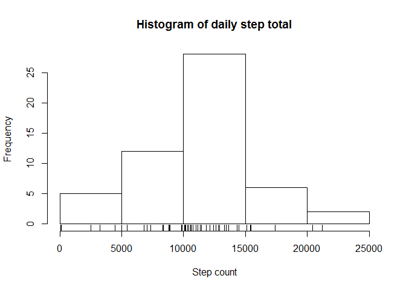
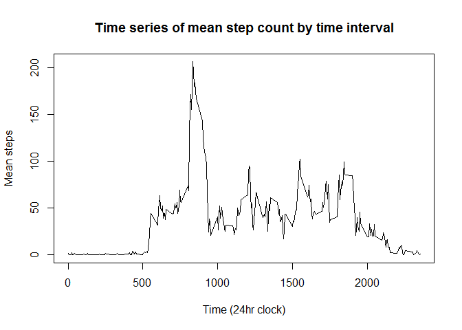
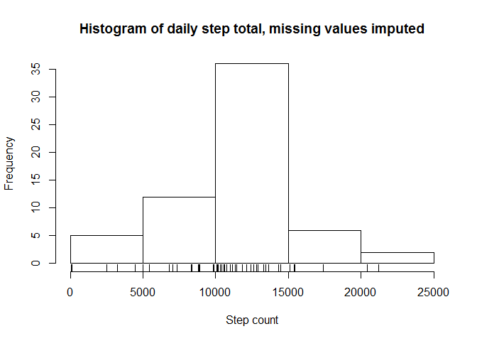
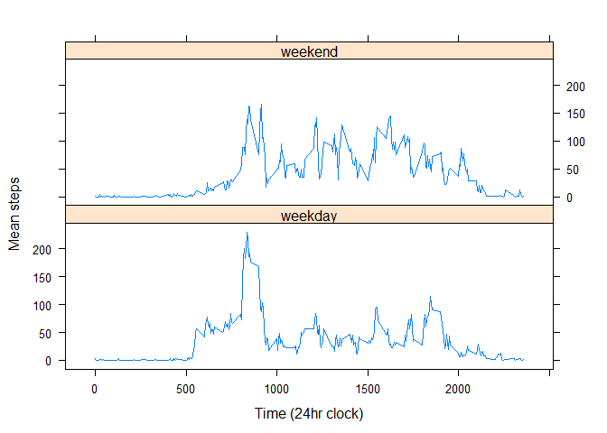

# Reproducible Research: Peer Assessment 1


## Loading and preprocessing the data

First, we load the data into a data frame "activitydata":


```r
activitydata <- read.csv("activity.csv")
```

Verify that we have the correct number of instances in the data set (should be 17,568):


```r
dim(activitydata)
```

```
## [1] 17568     3
```

## What is mean total number of steps taken per day?

Aggregate (sum) the data by day and prepare a histogram to show frequency of different step counts, with a rug to show the exact step counts:


```r
byday <- aggregate(. ~ date, data = activitydata, sum, na.rm = TRUE)
hist(byday$steps, main = "Histogram of daily step total", xlab = "Step count")
rug(byday$steps)
```

<!-- -->

Mean and median:


```r
median(byday$steps, na.rm = TRUE)
```

```
## [1] 10765
```

```r
mean(byday$steps, na.rm = TRUE)
```

```
## [1] 10766.19
```

## What is the average daily activity pattern?

Aggregate activity data by the five-minute intervals and plot a time series showing mean step count for each of these intervals over the measurement period:


```r
bytime <- aggregate(. ~ interval, data = activitydata, mean, na.rm = TRUE)
# Set row names equal to interval number
row.names(bytime) <- bytime$interval
plot(bytime$steps ~ bytime$interval, type = "l", main = "Time series of mean step count by time interval", xlab = "Time (24hr clock)", ylab = "Mean steps")
```

<!-- -->

Find the time (24hr clock) corresponding to maximum value:


```r
# Maximum activity level
max(bytime$steps)
```

```
## [1] 206.1698
```

```r
# Corresponding time interval
bytime$interval[which(bytime$steps == max(bytime$steps))]
```

```
## [1] 835
```

## Imputing missing values

Total number and proportion of NAs by column:


```r
# Absolute number
colSums(is.na(activitydata))
```

```
##    steps     date interval 
##     2304        0        0
```

```r
# Proportion
colSums(is.na(activitydata))/nrow(activitydata)
```

```
##     steps      date  interval 
## 0.1311475 0.0000000 0.0000000
```

Data tends to contain many consecutive NAs, so better to impute using the mean for the time interval, rather than using adjacent time intervals.

Initialise a new data frame and populate with values where steps is not NA:


```r
imputed <- data.frame(steps = integer(nrow(activitydata)), date = factor(nrow(activitydata)), interval = integer(nrow(activitydata)))
# Copy date and interval from original data frame
imputed[,2:3] <- activitydata[,2:3]
for (i in 1:nrow(activitydata)){
        # Use original data where steps is not NA
        if(!is.na(activitydata[i,1])){
                imputed[i,1] <- activitydata[i,1]
        }
        # Get mean of steps for the same interval, if steps is NA
        else {
                imputed[i,1] <- mean(activitydata[activitydata[,3] == imputed[i,3],1], na.rm = TRUE)
        }
}
# Check no values in imputed data frame are NA
colSums(is.na(imputed))
```

```
##    steps     date interval 
##        0        0        0
```

Plot imputed histogram:


```r
bydayimputed <- aggregate(. ~ date, data = imputed, sum, na.rm = TRUE)
hist(bydayimputed$steps, main = "Histogram of daily step total, missing values imputed", xlab = "Step count")
rug(bydayimputed$steps)
```

<!-- -->

Mean and median of imputed data set:


```r
median(bydayimputed$steps, na.rm = TRUE)
```

```
## [1] 10766.19
```

```r
mean(bydayimputed$steps, na.rm = TRUE)
```

```
## [1] 10766.19
```

Since missing values are replaced with means, the mean of the data is unchanged.  However, the addition of the mean values in place of the missing entries increases the frequency of the central bar of the histogram.

## Are there differences in activity patterns between weekdays and weekends?

First add weekday/weekend indicator to imputed data frame:


```r
imputed$isweekend <- weekdays(as.POSIXlt(imputed[,2])) == "Saturday" | weekdays(as.POSIXlt(imputed[,2])) == "Sunday"
imputed$daytype <- rep("weekday",nrow(imputed))
imputed$daytype[imputed$isweekend] <- "weekend"
```

Set up data frame containing mean step count by interval for weekdays and weekends:


```r
library(dplyr)
```

```
## 
## Attaching package: 'dplyr'
```

```
## The following objects are masked from 'package:stats':
## 
##     filter, lag
```

```
## The following objects are masked from 'package:base':
## 
##     intersect, setdiff, setequal, union
```

```r
group_by(imputed, daytype, interval) %>% summarise(steps = mean(steps)) -> bytimeimputed
```

Panel plot of step count for weekdays and weekends:


```r
library(lattice)
xyplot(steps ~ interval | daytype, data = bytimeimputed, type = "l", xlab = "Time (24hr clock)", ylab = "Mean steps", layout = c(1,2))
```

<!-- -->

We see that the step count is greater at weekends.  We can verify this by calculating means for weekdays and weekends:


```r
group_by(imputed, daytype) %>% summarise(steps = mean(steps))
```

```
## # A tibble: 2 x 2
##   daytype    steps
##     <chr>    <dbl>
## 1 weekday 35.61058
## 2 weekend 42.36640
```
